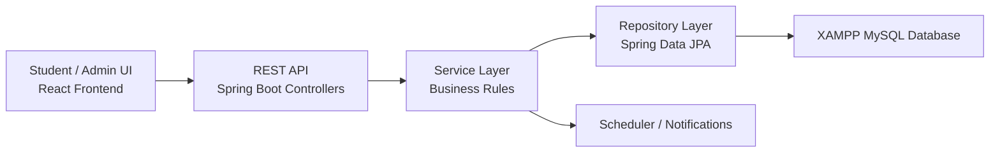

# TEK-UP Resourcely

TEK-UP Resourcely is a full-stack university equipment reservation platform built for academic presentation and portfolio use. It focuses on a realistic reservation workflow instead of a generic CRUD demo: students request equipment, administrators review and approve requests, reservation states evolve over time, date capacity is checked, and notifications keep both roles informed.

The project is a **monorepo** with:

```text
campus-resourcely/
|-- backend/   Spring Boot REST API
|-- frontend/  React + TanStack Router client
`-- docs/      presentation and defense material
```

## Project Goal

The system solves a practical TEK-UP problem: shared resources such as cameras, projectors, and embedded kits are often managed manually. This project digitizes the process with:

- a student portal for browsing and requesting equipment
- an admin portal for validation and management
- reservation approval logic instead of direct checkout
- return reminders and overdue alerts

## Why This Project Is Stronger Than Basic CRUD

- Separate student and admin experiences
- Reservation lifecycle with `PENDING`, `APPROVED`, `ACTIVE`, `RETURNED`, `OVERDUE`, and `REJECTED`
- Date-capacity booking rules
- Calendar-based reservation requests
- Admin and student notifications for requests, approvals, rejections, and returns
- Scheduled reminders with Spring `@Scheduled`
- Layered Spring Boot architecture using controller, service, repository, DTO, entity, and exception layers
- Clean frontend/backend separation through REST APIs

## Architecture



### Backend Responsibilities

The Spring Boot backend is the core of the project and the main academic focus. It is responsible for:

- exposing REST endpoints
- validating incoming requests with Bean Validation
- enforcing reservation rules
- managing JPA entities and relationships
- handling exception formatting
- scheduling automatic reminder notifications
- seeding demo data at startup

### Frontend Responsibilities

The frontend is a separate SPA that:

- authenticates students and admins
- calls the backend through `fetch` helpers
- displays dashboards, forms, calendars, and notifications
- separates student routes from admin routes

Important note: the current frontend in this repository is **React**, while the backend remains the academic Spring Boot focus.

## Monorepo Structure

### Backend

- `backend/src/main/java/com/academic/smartlibrary/CampusResourceHubBackendApplication.java`
- `backend/src/main/java/com/academic/smartlibrary/config/`
- `backend/src/main/java/com/academic/smartlibrary/controller/`
- `backend/src/main/java/com/academic/smartlibrary/dto/request/`
- `backend/src/main/java/com/academic/smartlibrary/dto/response/`
- `backend/src/main/java/com/academic/smartlibrary/entity/`
- `backend/src/main/java/com/academic/smartlibrary/exception/`
- `backend/src/main/java/com/academic/smartlibrary/repository/`
- `backend/src/main/java/com/academic/smartlibrary/service/`

### Frontend

- `frontend/src/routes/`
- `frontend/src/components/`
- `frontend/src/lib/`

### Documentation

- `docs/Campus-Resourcely-Spring-Boot-Defense.pptx`
- `docs/presentation-workspace/output/output.pptx`
- `docs/spring-boot-defense.md`

## Backend Technical Walkthrough

### 1. Application Bootstrapping

The backend starts from:

- [CampusResourceHubBackendApplication.java](backend\src\main\java\com\academic\smartlibrary\CampusResourceHubBackendApplication.java)

It uses:

- `@SpringBootApplication` for auto-configuration and component scanning
- `@ConfigurationPropertiesScan` to bind custom `app.*` properties
- `@EnableScheduling` to activate the notification cron job

### 2. Configuration

Main runtime configuration:

- [application.properties](backend\src\main\resources\application.properties)
- [AppProperties.java](backend\src\main\java\com\academic\smartlibrary\config\AppProperties.java)
- [CorsConfig.java](backend\src\main\java\com\academic\smartlibrary\config\CorsConfig.java)
- [SecurityConfig.java](backend\src\main\java\com\academic\smartlibrary\config\SecurityConfig.java)

Key choices:

- XAMPP MySQL database for persistent local data
- `update` schema lifecycle so Hibernate keeps existing demo changes
- local CORS allowed for ports `3000` and `4200`
- configurable default borrow duration through `app.borrow-days`
- stateless JWT authentication with role-based access control for admin and student routes

### 3. Domain Model

Main entities:

- [Student.java](backend\src\main\java\com\academic\smartlibrary\entity\Student.java)
- [StudentProfile.java](backend\src\main\java\com\academic\smartlibrary\entity\StudentProfile.java)
- [Resource.java](backend\src\main\java\com\academic\smartlibrary\entity\Resource.java)
- [ResourceTag.java](backend\src\main\java\com\academic\smartlibrary\entity\ResourceTag.java)
- [Reservation.java](backend\src\main\java\com\academic\smartlibrary\entity\Reservation.java)
- [Notification.java](backend\src\main\java\com\academic\smartlibrary\entity\Notification.java)

Relationships:

- `Student` <-> `StudentProfile`: `@OneToOne`
- `Reservation` -> `Student`: `@ManyToOne`
- `Reservation` -> `Resource`: `@ManyToOne`
- `Resource` <-> `ResourceTag`: `@ManyToMany`
- `Notification` -> `Student`: `@ManyToOne`
- `Notification` -> `Reservation`: `@ManyToOne`

### 4. DTO Layer

The backend does not expose entities directly. It uses request/response DTOs such as:

- [StudentRequest.java](backend\src\main\java\com\academic\smartlibrary\dto\request\StudentRequest.java)
- [StudentReservationRequest.java](backend\src\main\java\com\academic\smartlibrary\dto\request\StudentReservationRequest.java)
- [ReservationRequest.java](backend\src\main\java\com\academic\smartlibrary\dto\request\ReservationRequest.java)
- [ReservationResponse.java](backend\src\main\java\com\academic\smartlibrary\dto\response\ReservationResponse.java)

Why this matters:

- isolates the API contract from the database model
- adds request validation annotations like `@NotBlank`, `@Email`, `@Min`, and `@Max`
- allows response shaping for the frontend

### 5. Repository Layer

Repositories extend Spring Data JPA and abstract direct SQL access:

- `StudentRepository`
- `ResourceRepository`
- `ResourceTagRepository`
- `ReservationRepository`
- `NotificationRepository`

This is where Spring Data generates query methods such as:

- `findByEmail(...)`
- `findByStudentId(...)`
- `findByStatus(...)`
- `findByTypeContainingIgnoreCase(...)`

### 6. Service Layer

The service layer contains the real business rules:

- [StudentService.java](backend\src\main\java\com\academic\smartlibrary\service\StudentService.java)
- [ResourceService.java](backend\src\main\java\com\academic\smartlibrary\service\ResourceService.java)
- [ReservationService.java](backend\src\main\java\com\academic\smartlibrary\service\ReservationService.java)
- [NotificationService.java](backend\src\main\java\com\academic\smartlibrary\service\NotificationService.java)
- [DashboardService.java](backend\src\main\java\com\academic\smartlibrary\service\DashboardService.java)

Important business rules implemented there:

- students must reserve at least `2` days in advance
- student requests must start and end on weekdays
- student requests cannot exceed `7` weekdays
- admin-created reservations can use up to `31` calendar days
- resource quantity represents total capacity, not a live counter of units left today
- confirmed reservations consume capacity only for their selected dates
- pending student requests do not block dates until an admin approves them
- overlapping reservations cannot exceed total capacity for the same resource
- overflow pending requests are rejected automatically when capacity is filled
- overdue reservations are refreshed dynamically

### 7. Controller Layer

REST endpoints are exposed through:

- [AuthController.java](backend\src\main\java\com\academic\smartlibrary\controller\AuthController.java)
- [StudentController.java](backend\src\main\java\com\academic\smartlibrary\controller\StudentController.java)
- [ResourceController.java](backend\src\main\java\com\academic\smartlibrary\controller\ResourceController.java)
- [ResourceTagController.java](backend\src\main\java\com\academic\smartlibrary\controller\ResourceTagController.java)
- [ReservationController.java](backend\src\main\java\com\academic\smartlibrary\controller\ReservationController.java)
- [DashboardController.java](backend\src\main\java\com\academic\smartlibrary\controller\DashboardController.java)
- [NotificationController.java](backend\src\main\java\com\academic\smartlibrary\controller\NotificationController.java)

The controller layer stays thin: it receives HTTP input, validates it, delegates to services, and returns `ResponseEntity`.

### 8. Exception Handling

Centralized exception handling lives in:

- [GlobalExceptionHandler.java](backend\src\main\java\com\academic\smartlibrary\exception\GlobalExceptionHandler.java)

Handled exception categories:

- `ResourceNotFoundException` -> `404`
- `BusinessException` -> `400`
- `MethodArgumentNotValidException` -> `400` with validation details

This gives the frontend a consistent JSON error structure.

## Reservation Workflow

This is the most important business flow in the project.

### Student request

1. Student chooses equipment and a calendar range in the frontend.
2. Frontend sends `POST /api/reservations/request/student` with the student's JWT.
3. Backend validates date rules and student limits.
4. A reservation is created with status `PENDING`.
5. The admin receives a notification about the new request.

### Admin approval

1. Admin reviews pending requests.
2. Admin approves through `PUT /api/reservations/{id}/approve`.
3. Backend checks capacity again for the selected date range.
4. If capacity is available, the backend converts the request to:
   - `APPROVED` if the start date is still in the future
   - `ACTIVE` if the start date is today
5. The student receives an approval notification.
6. If capacity is no longer available, the request becomes `REJECTED` and the student is notified.
7. Any other pending requests that now exceed capacity are automatically rejected.

### Return flow

1. Admin marks the reservation as returned.
2. Backend sets `actualReturnDate`.
3. Status becomes `RETURNED`.
4. Quantity is not changed, because quantity is total resource capacity. Availability is calculated from overlapping confirmed reservations.

### Overdue logic

Whenever reservation data is fetched, the service refreshes statuses:

- `APPROVED` becomes `ACTIVE` on its start date
- active reservations become `OVERDUE` after the expected return date
- old unapproved pending requests become `REJECTED`

## Notification System

The notification feature is implemented in:

- [NotificationService.java](backend\src\main\java\com\academic\smartlibrary\service\NotificationService.java)

Supported use cases:

- automatic return reminders during the last 2 days before the deadline
- admin notifications when students submit reservation requests
- student notifications when requests are approved or rejected
- manual admin alerts for overdue reservations
- read / unread tracking

Spring Boot concepts used:

- `@Scheduled(cron = "0 0 8 * * *")`
- `@EventListener(ApplicationReadyEvent.class)`
- `@Transactional`

## Seed Data

The demo data is created in:

- [DataSeeder.java](backend\src\main\java\com\academic\smartlibrary\config\DataSeeder.java)

It seeds:

- 4 resource tags
- 3 equipment resources
- 6 student accounts
- 1 active reservation
- 1 overdue reservation
- 1 pending reservation

This makes the app ready to present immediately after startup.

Demo student phone numbers use the Tunisian `+216` format so the seed data matches the TEK-UP context.

## Demo Accounts

### Admin

- `admin` / `admin123`
- `test` / `test`

### Students

- `montassar@tek-up.tn` / `student123`
- `ilyes@tek-up.tn` / `student123`
- `hichem@tek-up.tn` / `student123`
- `y.ahyaoui@tek-up.tn` / `student123`
- `s.khider@tek-up.tn` / `student123`
- `n.mansouri@tek-up.tn` / `student123`
- `m.trabelsi@tek-up.tn` / `student123`
- `a.gharbi@tek-up.tn` / `student123`
- `l.saidi@tek-up.tn` / `student123`

Student profile levels follow the TEK-UP format `ING-year-schedule-branch-group` from year 4.
For example, `ING-4-S-SDIA-B` means engineering year 4, evening classes, SDIA branch, group B.
In year 3, students are still in common core, so the format is `ING-3-schedule-group`, for example `ING-3-S-A`.
The demo specializations from year 4 are `SDIA`, `GL`, and `CYBER`.

## Main API Areas

- `GET /api/dashboard/summary`
- `POST /api/auth/student/login`
- `POST /api/auth/admin/login`
- `GET /api/students`
- `GET /api/resources`
- `GET /api/resources/available`
- `POST /api/reservations`
- `POST /api/reservations/request`
- `POST /api/reservations/request/student`
- `GET /api/reservations/resource/{resourceId}`
- `PUT /api/reservations/{id}/approve`
- `PUT /api/reservations/{id}/return`
- `DELETE /api/reservations/{id}`
- `GET /api/notifications/admin`
- `GET /api/notifications/student/{studentId}`
- `PUT /api/notifications/admin/read-all`

## Local Development

### Backend

```powershell
cd backend
cmd /c mvnw.cmd spring-boot:run
```

Backend URLs:

- API: `http://localhost:8080/api`
- Database UI: `http://localhost/phpmyadmin`

### XAMPP MySQL Database

The backend uses XAMPP MySQL by default.

1. Start XAMPP and turn on MySQL.
2. Open phpMyAdmin and run `backend/database/xampp-mysql.sql`, or create a database named
   `campus_resourcely`.
3. Start the backend:

```powershell
cd backend
cmd /c mvnw.cmd spring-boot:run
```

The backend connects to `localhost:3306` with XAMPP's default `root` user and empty password.
Hibernate creates or updates the tables from the JPA entities, and `DataSeeder` inserts the demo data
when the database is empty. The data stays in MySQL after backend restarts.

### Frontend

```powershell
cd frontend
cmd /c npm.cmd install
cmd /c npm.cmd run dev -- --host 0.0.0.0 --port 3000
```

Frontend URLs:

- Student portal: `http://localhost:3000/`
- Admin portal: `http://localhost:3000/admin/auth`

## Build And Test

### Backend

```powershell
cd backend
cmd /c mvnw.cmd test
```

### Frontend

```powershell
cd frontend
cmd /c npm.cmd run build
```

## What To Say In The Presentation

Short version:

“TEK-UP Resourcely is a TEK-UP equipment reservation platform. Spring Boot is used as a REST backend with layered architecture: controllers expose endpoints, services contain the business rules, repositories access data through JPA, DTOs protect the API contract, and notifications automate the request, approval, rejection, and reminder workflow. The frontend is separated from the backend and consumes the API as a single-page application.”

## Current Limits

- Authentication is implemented in the Spring Boot backend with JWT tokens and role-based access control.
- Database is local XAMPP MySQL for persistent demo data
- Passwords are stored plainly for academic/demo scope, not production security
- Frontend is React in this repository, not Angular

## Suggested Next Improvements

- Hash passwords with BCrypt before production use.
- Add migration scripts with Flyway or Liquibase
- Add Docker and deployment
- Add file upload for resource images
- Add audit logs for approval and return actions

