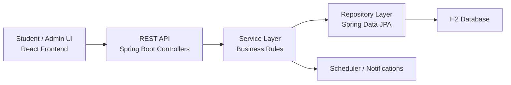

# Campus Resourcely

Campus Resourcely is a full-stack university equipment reservation platform built for academic presentation and portfolio use. It focuses on a realistic reservation workflow instead of a generic CRUD demo: students request equipment, administrators review and approve requests, reservation states evolve over time, stock is tracked, and notifications remind students before and after the deadline.

The project is a **monorepo** with:

```text
campus-resourcely/
|-- backend/   Spring Boot REST API
|-- frontend/  React + TanStack Router client
`-- docs/      presentation and defense material
```

## Project Goal

The system solves a practical campus problem: shared resources such as cameras, projectors, and embedded kits are often managed manually. This project digitizes the process with:

- a student portal for browsing and requesting equipment
- an admin portal for validation and management
- reservation approval logic instead of direct checkout
- return reminders and overdue alerts

## Why This Project Is Stronger Than Basic CRUD

- Separate student and admin experiences
- Reservation lifecycle with `PENDING`, `APPROVED`, `ACTIVE`, `RETURNED`, `OVERDUE`, and `REJECTED`
- Stock-aware booking rules
- Calendar-based reservation requests
- Scheduled notifications with Spring `@Scheduled`
- Layered Spring Boot architecture using controller, service, repository, DTO, entity, and exception layers
- Clean frontend/backend separation through REST APIs

## Architecture



### Backend Responsibilities

The Spring Boot backend is the core of the project and the main academic focus. It is responsible for:

- exposing REST endpoints
- validating incoming requests with Bean Validation
- enforcing reservation rules
- managing JPA entities and relationships
- handling exception formatting
- scheduling automatic reminder notifications
- seeding demo data at startup

### Frontend Responsibilities

The frontend is a separate SPA that:

- authenticates students and admins
- calls the backend through `fetch` helpers
- displays dashboards, forms, calendars, and notifications
- separates student routes from admin routes

Important note: the current frontend in this repository is **React**, while the backend remains the academic Spring Boot focus.

## Monorepo Structure

### Backend

- `backend/src/main/java/com/academic/smartlibrary/CampusResourceHubBackendApplication.java`
- `backend/src/main/java/com/academic/smartlibrary/config/`
- `backend/src/main/java/com/academic/smartlibrary/controller/`
- `backend/src/main/java/com/academic/smartlibrary/dto/request/`
- `backend/src/main/java/com/academic/smartlibrary/dto/response/`
- `backend/src/main/java/com/academic/smartlibrary/entity/`
- `backend/src/main/java/com/academic/smartlibrary/exception/`
- `backend/src/main/java/com/academic/smartlibrary/repository/`
- `backend/src/main/java/com/academic/smartlibrary/service/`

### Frontend

- `frontend/src/routes/`
- `frontend/src/components/`
- `frontend/src/lib/`

### Documentation

- `docs/presentation-workspace/output/output.pptx`
- `docs/spring-boot-defense.md`

## Backend Technical Walkthrough

### 1. Application Bootstrapping

The backend starts from:

- [CampusResourceHubBackendApplication.java](C:\Users\a\Desktop\spring bot\campus-resourcely\backend\src\main\java\com\academic\smartlibrary\CampusResourceHubBackendApplication.java)

It uses:

- `@SpringBootApplication` for auto-configuration and component scanning
- `@ConfigurationPropertiesScan` to bind custom `app.*` properties
- `@EnableScheduling` to activate the notification cron job

### 2. Configuration

Main runtime configuration:

- [application.properties](C:\Users\a\Desktop\spring bot\campus-resourcely\backend\src\main\resources\application.properties)
- [AppProperties.java](C:\Users\a\Desktop\spring bot\campus-resourcely\backend\src\main\java\com\academic\smartlibrary\config\AppProperties.java)
- [CorsConfig.java](C:\Users\a\Desktop\spring bot\campus-resourcely\backend\src\main\java\com\academic\smartlibrary\config\CorsConfig.java)

Key choices:

- H2 in-memory database for academic/demo simplicity
- `create-drop` schema lifecycle
- local CORS allowed for ports `3000` and `4200`
- configurable default borrow duration through `app.borrow-days`

### 3. Domain Model

Main entities:

- [Student.java](C:\Users\a\Desktop\spring bot\campus-resourcely\backend\src\main\java\com\academic\smartlibrary\entity\Student.java)
- [StudentProfile.java](C:\Users\a\Desktop\spring bot\campus-resourcely\backend\src\main\java\com\academic\smartlibrary\entity\StudentProfile.java)
- [Resource.java](C:\Users\a\Desktop\spring bot\campus-resourcely\backend\src\main\java\com\academic\smartlibrary\entity\Resource.java)
- [ResourceTag.java](C:\Users\a\Desktop\spring bot\campus-resourcely\backend\src\main\java\com\academic\smartlibrary\entity\ResourceTag.java)
- [Reservation.java](C:\Users\a\Desktop\spring bot\campus-resourcely\backend\src\main\java\com\academic\smartlibrary\entity\Reservation.java)
- [Notification.java](C:\Users\a\Desktop\spring bot\campus-resourcely\backend\src\main\java\com\academic\smartlibrary\entity\Notification.java)

Relationships:

- `Student` <-> `StudentProfile`: `@OneToOne`
- `Reservation` -> `Student`: `@ManyToOne`
- `Reservation` -> `Resource`: `@ManyToOne`
- `Resource` <-> `ResourceTag`: `@ManyToMany`
- `Notification` -> `Student`: `@ManyToOne`
- `Notification` -> `Reservation`: `@ManyToOne`

### 4. DTO Layer

The backend does not expose entities directly. It uses request/response DTOs such as:

- [StudentRequest.java](C:\Users\a\Desktop\spring bot\campus-resourcely\backend\src\main\java\com\academic\smartlibrary\dto\request\StudentRequest.java)
- [StudentReservationRequest.java](C:\Users\a\Desktop\spring bot\campus-resourcely\backend\src\main\java\com\academic\smartlibrary\dto\request\StudentReservationRequest.java)
- [ReservationRequest.java](C:\Users\a\Desktop\spring bot\campus-resourcely\backend\src\main\java\com\academic\smartlibrary\dto\request\ReservationRequest.java)
- [ReservationResponse.java](C:\Users\a\Desktop\spring bot\campus-resourcely\backend\src\main\java\com\academic\smartlibrary\dto\response\ReservationResponse.java)

Why this matters:

- isolates the API contract from the database model
- adds request validation annotations like `@NotBlank`, `@Email`, `@Min`, and `@Max`
- allows response shaping for the frontend

### 5. Repository Layer

Repositories extend Spring Data JPA and abstract direct SQL access:

- `StudentRepository`
- `ResourceRepository`
- `ResourceTagRepository`
- `ReservationRepository`
- `NotificationRepository`

This is where Spring Data generates query methods such as:

- `findByEmail(...)`
- `findByStudentId(...)`
- `findByStatus(...)`
- `findByTypeContainingIgnoreCase(...)`

### 6. Service Layer

The service layer contains the real business rules:

- [StudentService.java](C:\Users\a\Desktop\spring bot\campus-resourcely\backend\src\main\java\com\academic\smartlibrary\service\StudentService.java)
- [ResourceService.java](C:\Users\a\Desktop\spring bot\campus-resourcely\backend\src\main\java\com\academic\smartlibrary\service\ResourceService.java)
- [ReservationService.java](C:\Users\a\Desktop\spring bot\campus-resourcely\backend\src\main\java\com\academic\smartlibrary\service\ReservationService.java)
- [NotificationService.java](C:\Users\a\Desktop\spring bot\campus-resourcely\backend\src\main\java\com\academic\smartlibrary\service\NotificationService.java)
- [DashboardService.java](C:\Users\a\Desktop\spring bot\campus-resourcely\backend\src\main\java\com\academic\smartlibrary\service\DashboardService.java)

Important business rules implemented there:

- students must reserve at least `2` days in advance
- student requests must start and end on weekdays
- student requests cannot exceed `7` weekdays
- admin-created reservations can use up to `31` calendar days
- resource stock is decremented only when a reservation becomes active
- reservations cannot overlap beyond total capacity
- overdue reservations are refreshed dynamically

### 7. Controller Layer

REST endpoints are exposed through:

- [StudentController.java](C:\Users\a\Desktop\spring bot\campus-resourcely\backend\src\main\java\com\academic\smartlibrary\controller\StudentController.java)
- [ResourceController.java](C:\Users\a\Desktop\spring bot\campus-resourcely\backend\src\main\java\com\academic\smartlibrary\controller\ResourceController.java)
- [ResourceTagController.java](C:\Users\a\Desktop\spring bot\campus-resourcely\backend\src\main\java\com\academic\smartlibrary\controller\ResourceTagController.java)
- [ReservationController.java](C:\Users\a\Desktop\spring bot\campus-resourcely\backend\src\main\java\com\academic\smartlibrary\controller\ReservationController.java)
- [DashboardController.java](C:\Users\a\Desktop\spring bot\campus-resourcely\backend\src\main\java\com\academic\smartlibrary\controller\DashboardController.java)
- [NotificationController.java](C:\Users\a\Desktop\spring bot\campus-resourcely\backend\src\main\java\com\academic\smartlibrary\controller\NotificationController.java)

The controller layer stays thin: it receives HTTP input, validates it, delegates to services, and returns `ResponseEntity`.

### 8. Exception Handling

Centralized exception handling lives in:

- [GlobalExceptionHandler.java](C:\Users\a\Desktop\spring bot\campus-resourcely\backend\src\main\java\com\academic\smartlibrary\exception\GlobalExceptionHandler.java)

Handled exception categories:

- `ResourceNotFoundException` -> `404`
- `BusinessException` -> `400`
- `MethodArgumentNotValidException` -> `400` with validation details

This gives the frontend a consistent JSON error structure.

## Reservation Workflow

This is the most important business flow in the project.

### Student request

1. Student chooses equipment and a calendar range in the frontend.
2. Frontend sends `POST /api/reservations/request`.
3. Backend validates dates, weekday rules, and resource availability.
4. A reservation is created with status `PENDING`.

### Admin approval

1. Admin reviews pending requests.
2. Admin approves through `PUT /api/reservations/{id}/approve`.
3. Backend converts the request to:
   - `APPROVED` if the start date is still in the future
   - `ACTIVE` if the start date is today
4. Stock is decremented only when the reservation is active.

### Return flow

1. Admin marks the reservation as returned.
2. Backend sets `actualReturnDate`.
3. Status becomes `RETURNED`.
4. Stock is incremented again.

### Overdue logic

Whenever reservation data is fetched, the service refreshes statuses:

- `APPROVED` becomes `ACTIVE` on its start date
- active reservations become `OVERDUE` after the expected return date
- old unapproved pending requests become `REJECTED`

## Notification System

The notification feature is implemented in:

- [NotificationService.java](C:\Users\a\Desktop\spring bot\campus-resourcely\backend\src\main\java\com\academic\smartlibrary\service\NotificationService.java)

Supported use cases:

- automatic return reminders during the last 2 days before the deadline
- manual admin alerts for overdue reservations
- read / unread tracking

Spring Boot concepts used:

- `@Scheduled(cron = "0 0 8 * * *")`
- `@EventListener(ApplicationReadyEvent.class)`
- `@Transactional`

## Seed Data

The demo data is created in:

- [DataSeeder.java](C:\Users\a\Desktop\spring bot\campus-resourcely\backend\src\main\java\com\academic\smartlibrary\config\DataSeeder.java)

It seeds:

- 4 resource tags
- 3 equipment resources
- 6 student accounts
- 1 active reservation
- 1 overdue reservation
- 1 pending reservation

This makes the app ready to present immediately after startup.

## Demo Accounts

### Admin

- `admin` / `admin123`
- `test` / `test`

### Students

- `aminah@campus.edu` / `aminah123`
- `david@campus.edu` / `david123`
- `m.benali@campus.edu` / `student123`
- `y.ahyaoui@campus.edu` / `student123`
- `s.khider@campus.edu` / `student123`
- `n.mansouri@campus.edu` / `student123`

## Main API Areas

- `GET /api/dashboard/summary`
- `POST /api/students/login`
- `GET /api/students`
- `GET /api/resources`
- `GET /api/resources/available`
- `POST /api/reservations`
- `POST /api/reservations/request`
- `PUT /api/reservations/{id}/approve`
- `PUT /api/reservations/{id}/return`
- `GET /api/notifications/student/{studentId}`

## Local Development

### Backend

```powershell
cd backend
cmd /c mvnw.cmd spring-boot:run
```

Backend URLs:

- API: `http://localhost:8080/api`
- H2 console: `http://localhost:8080/h2-console`

### Frontend

```powershell
cd frontend
cmd /c npm.cmd install
cmd /c npm.cmd run dev -- --host 0.0.0.0 --port 3000
```

Frontend URLs:

- Student portal: `http://localhost:3000/`
- Admin portal: `http://localhost:3000/admin/auth`

## Build And Test

### Backend

```powershell
cd backend
cmd /c mvnw.cmd test
```

### Frontend

```powershell
cd frontend
cmd /c npm.cmd run build
```

## What To Say In The Presentation

Short version:

“Campus Resourcely is a campus equipment reservation platform. Spring Boot is used as a REST backend with layered architecture: controllers expose endpoints, services contain the business rules, repositories access data through JPA, DTOs protect the API contract, and scheduled notifications automate reminder logic. The frontend is separated from the backend and consumes the API as a single-page application.”

## Current Limits

- Admin authentication is still demo-style frontend authentication, not Spring Security or JWT
- Database is H2 in-memory for classroom/demo simplicity
- Passwords are stored plainly for academic/demo scope, not production security
- Frontend is React in this repository, not Angular

## Suggested Next Improvements

- Replace demo admin auth with backend authentication
- Add Spring Security and JWT
- Migrate from H2 to PostgreSQL
- Add Docker and deployment
- Add file upload for resource images
- Add audit logs for approval and return actions
